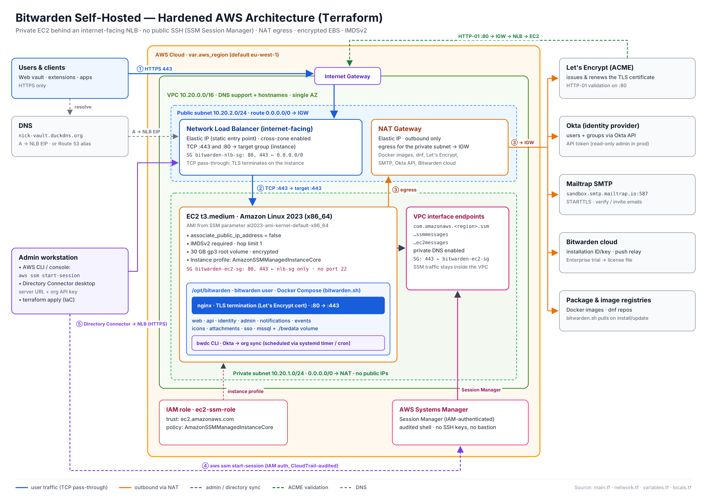
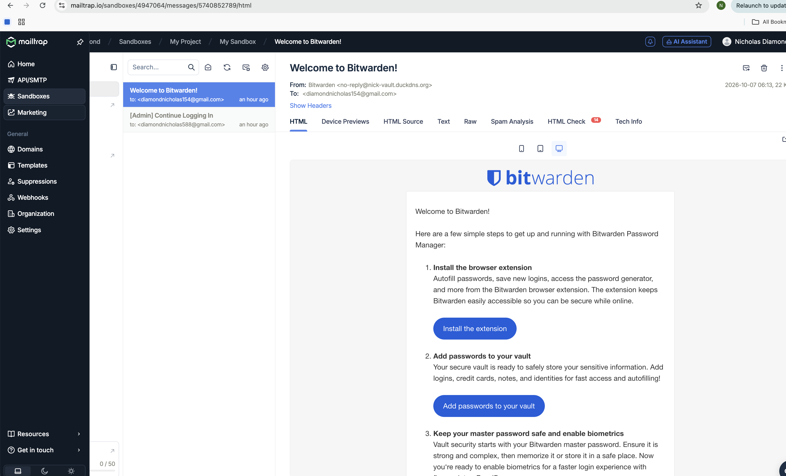
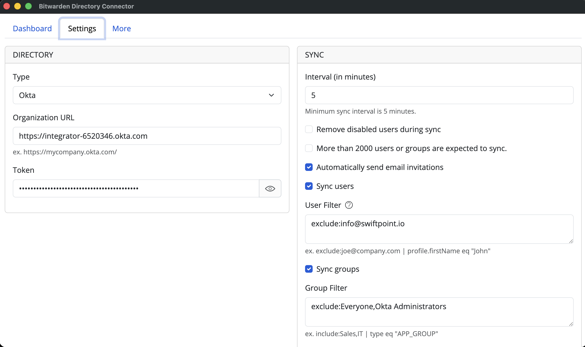
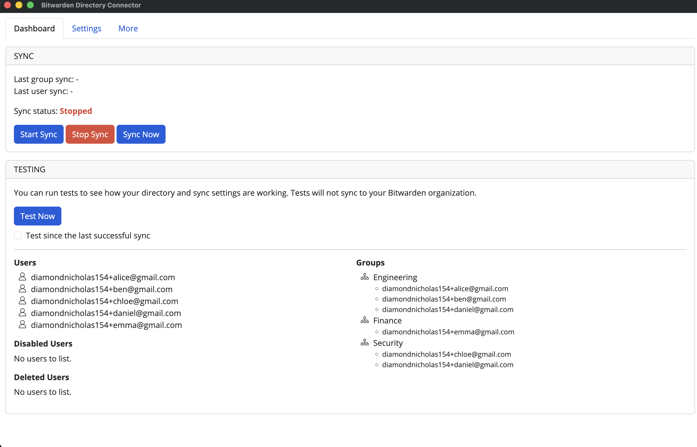
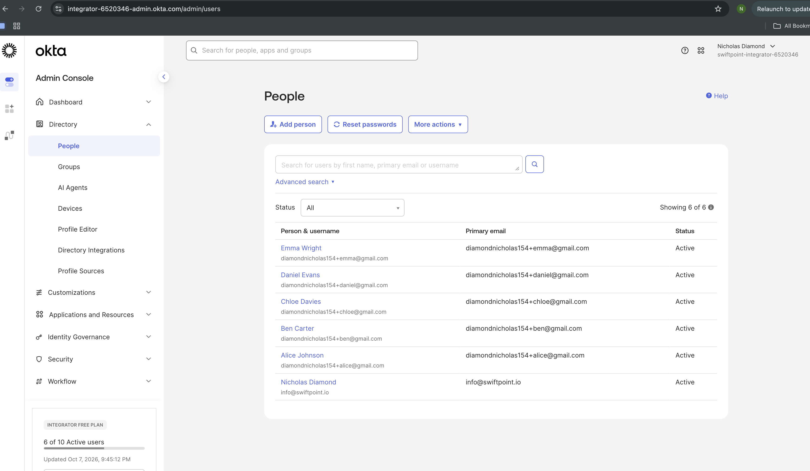
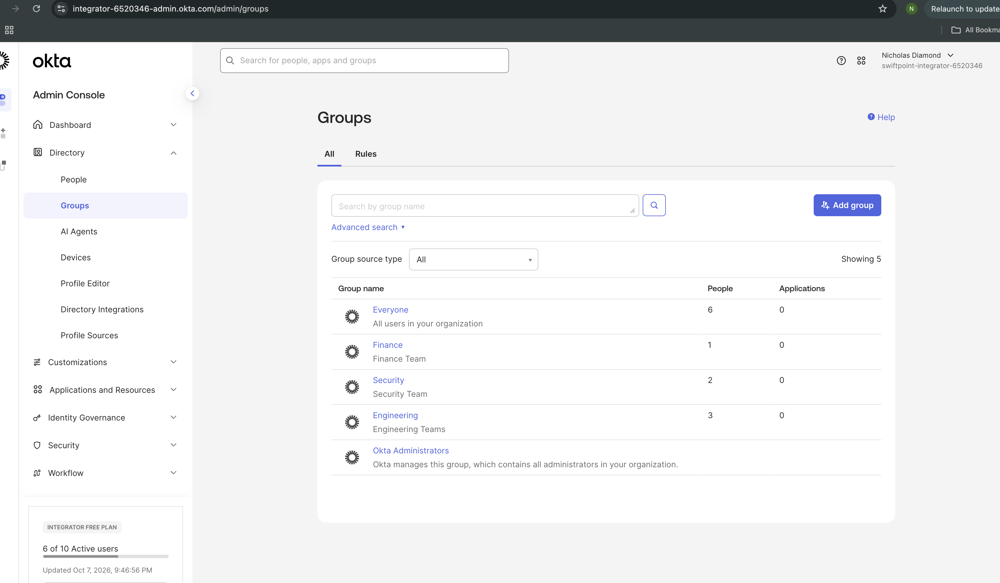

# Bitwarden Self-Hosted — Technical Assessment

This repository documents how I deployed a self-hosted Bitwarden server on AWS, configured SMTP, and (bonus) synced users and groups from Okta using the Bitwarden Directory Connector.

| | |
|---|---|
| **Vault URL** | https://nick-vault.duckdns.org |
| **Platform** | AWS EC2 (`t3.medium`, Amazon Linux 2023, x86_64) |
| **TLS** | Let's Encrypt (issued and managed by the Bitwarden installer) |
| **SMTP** | Mailtrap Email Sandbox (STARTTLS on port 587) |
| **Directory sync** | Okta → Bitwarden Directory Connector (Enterprise trial license) |
| **Versions** | `bitwarden.sh` 2026.9.2 · Docker 25.0.14 · Docker Compose v5.6.0 |

---

## Table of contents

1. [Architecture](#1-architecture)
2. [Infrastructure (AWS)](#2-infrastructure-aws)
3. [DNS and network validation](#3-dns-and-network-validation)
4. [Docker and Docker Compose](#4-docker-and-docker-compose-amazon-linux-2023)
5. [Bitwarden service account](#5-bitwarden-service-account-and-directory)
6. [Bitwarden installation](#6-bitwarden-installation)
7. [SMTP configuration](#7-smtp-configuration)
8. [Account creation and email proof](#8-account-creation-and-email-proof)
9. [Bonus: Directory Connector with Okta](#9-bonus-directory-connector-with-okta)
10. [Production recommendations](#12-production-recommendations)


## 1. Architecture




## 2. Infrastructure (AWS)

1. **EC2 instance:** launched a `t3.medium` (2 vCPU / 4 GB RAM) with Amazon Linux 2023 (x86_64) and a 30 GB gp3 root volume.
   - Bitwarden's minimum is 2 GB RAM; 4 GB gives headroom for the bundled MSSQL container.
   - I chose x86_64 over Graviton to avoid container-architecture issues.
   - The instance is placed in a private subnet and is not directly exposed to the internet.
2. **Networking and public entry:**
   - VPC with one private subnet for the EC2 instance and one public subnet for the internet-facing load balancer and NAT gateway.
   - Public internet access is limited to the NLB on ports 80 and 443.
   - The EC2 is reachable only via the NLB and AWS Systems Manager Session Manager; no public SSH is exposed.
   - Route tables are configured so the private subnet egresses through the NAT gateway, while the public subnet routes to the internet gateway.
3. **Security groups:**

   | Security group | Port | Protocol | Source | Purpose |
   |---|---|---|---|---|
   | `bitwarden-nlb-sg` | 80 | TCP | `0.0.0.0/0` | Internet-facing HTTP entry |
   | `bitwarden-nlb-sg` | 443 | TCP | `0.0.0.0/0` | Internet-facing HTTPS entry |
   | `bitwarden-ec2-sg` | 80 | TCP | `bitwarden-nlb-sg` | Allow HTTP from the load balancer |
   | `bitwarden-ec2-sg` | 443 | TCP | `bitwarden-nlb-sg` | Allow HTTPS from the load balancer |
   | `bitwarden-vpc-endpoints-sg` | 443 | TCP | `bitwarden-ec2-sg` | Session Manager VPC interface endpoints |

4. **TLS and DNS:**
   - TLS is terminated by the public NLB, and the site is served through a Route 53 alias to a stable public DNS record.
   - ACM certificate management can be used for a public certificate; if desired, Let's Encrypt can also be used on the instance itself.
5. **Static public endpoint:**
   - An Elastic IP is associated with the public-facing NLB so the entry point remains static and does not change after stop/start events.
   - This keeps a fixed public DNS target while the EC2 instance remains private.
6. **Admin access model:**
   - SSH is not exposed publicly.
   - Administration is handled with AWS Systems Manager Session Manager, which avoids opening port 22 to the internet.
   - The EC2 has an IAM instance profile with the AmazonSSMManagedInstanceCore policy.
7. **Storage and security hardening:**
   - The root EBS volume is encrypted with gp3 storage.
   - IAM instance profiles and security groups are used to keep the environment least-privilege and auditable.

---

## 3. DNS and network validation

1. Created a free subdomain at [DuckDNS](https://www.duckdns.org): **`nick-vault.duckdns.org`**.
2. Pointed the subdomain's A record to the Elastic IP.
3. **Validated resolution** from both inside the instance and my laptop:

   ```bash
   # Domain → IP
   dig +short nick-vault.duckdns.org
   dig +short AAAA nick-vault.duckdns.org   # expect empty

   # Instance public IP (IMDSv2)
   TOKEN=$(curl -s -X PUT "http://169.254.169.254/latest/api/token" \
     -H "X-aws-ec2-metadata-token-ttl-seconds: 60")
   curl -s -H "X-aws-ec2-metadata-token: $TOKEN" \
     http://169.254.169.254/latest/meta-data/public-ipv4
   ```

   Both returned the Elastic IP.

4. **Validated end-to-end reachability on port 80.** I started a temporary listener, tested from my laptop, then stopped it so port 80 was free for Let's Encrypt:

   ```bash
   # On the instance
   sudo python3 -m http.server 80

   # From my laptop
   curl -I http://nick-vault.duckdns.org    # → HTTP/1.0 200 OK
   ```

---

## 4. Docker and Docker Compose 

[Bitwarden's docs](https://bitwarden.com/en-gb/help/install-on-premise-linux/#install-docker-and-docker-compose) was used as a guide to complete installation.

```bash
sudo dnf update -y
sudo dnf install -y docker
sudo systemctl enable --now docker

sudo mkdir -p /usr/local/lib/docker/cli-plugins
sudo curl -SL https://github.com/docker/compose/releases/latest/download/docker-compose-linux-x86_64 \
  -o /usr/local/lib/docker/cli-plugins/docker-compose
sudo chmod +x /usr/local/lib/docker/cli-plugins/docker-compose

docker --version
docker compose version
```

---

## 5. Bitwarden service account and directory

Following [Bitwarden's guidance](https://bitwarden.com/en-gb/help/install-on-premise-linux/#install-docker-and-docker-compose), the stack runs under a dedicated, unprivileged service account rather than `root` or `ec2-user`:

```bash
sudo adduser bitwarden
sudo usermod -aG docker bitwarden        # Docker access only, no sudo
sudo mkdir /opt/bitwarden
sudo chmod -R 700 /opt/bitwarden
sudo chown -R bitwarden:bitwarden /opt/bitwarden

# Lock the password: no direct login or brute-force surface.
# The account is only reachable via sudo from an admin user.
sudo passwd -l bitwarden

# Switch with a full login shell (sets HOME, PATH, and group membership)
sudo -iu bitwarden
cd /opt/bitwarden
docker ps    # confirms Docker access without sudo
```

The `bitwarden` user is intentionally **not** in sudoers (least privilege).

---

## 6. Bitwarden installation

1. **Installation ID and key:** retrieved from https://bitwarden.com/host using my email, selecting the **same data region as my Bitwarden cloud account**. The region must match for license downloads to work later.
2. **Downloaded and ran the installer** as the `bitwarden` user from `/opt/bitwarden`:

   ```bash
   curl -Lso bitwarden.sh "https://func.bitwarden.com/api/dl/?app=self-host&platform=linux" \
     && chmod 700 bitwarden.sh
   ./bitwarden.sh install
   ```

3. **Installer prompts and answers:**

   | Prompt | Answer |
   |---|---|
   | Domain name | `nick-vault.duckdns.org` |
   | Use Let's Encrypt? | `y` |
   | Email for Let's Encrypt | personal email (used for expiry notices only) |
   | Database name | `vault` |
   | Region | matched to my cloud account |
   | Installation ID / Key | from bitwarden.com/host |

4. **Started the stack and verified it:**

   ```bash
   ./bitwarden.sh start
   docker ps    # all bitwarden-* containers healthy
   ```

   `https://nick-vault.duckdns.org` loads with a valid Let's Encrypt certificate, and HTTP redirects to HTTPS.

---

## 7. SMTP configuration

I used the **Mailtrap Email Sandbox**. It accepts mail over authenticated SMTP and captures it in a web inbox instead of delivering it to real recipients, which is ideal for testing.

Mailtrap supports **STARTTLS on all ports**, where the connection starts in plain text and is upgraded to TLS. In Bitwarden, `smtp__ssl=true` means *implicit* TLS, so the correct setting is **`ssl=false` with port 587**. The session is still encrypted via STARTTLS.

I edited `./bwdata/env/global.override.env`, replacing the existing placeholder lines rather than appending duplicates:

```ini
globalSettings__mail__replyToEmail=no-reply@nick-vault.duckdns.org
globalSettings__mail__smtp__host=sandbox.smtp.mailtrap.io
globalSettings__mail__smtp__port=587
globalSettings__mail__smtp__ssl=false
globalSettings__mail__smtp__username=<redacted>
globalSettings__mail__smtp__password=<redacted>
adminSettings__admins=<admin email>
```

Then I applied the change:

```bash
./bitwarden.sh restart    # env changes need a restart; config.yml changes need ./bitwarden.sh rebuild
```

**Verification:** I requested a login link at `https://nick-vault.duckdns.org/admin`. The "Admin Login" email arrived in the Mailtrap sandbox, confirming SMTP works end to end.

---

## 8. Account creation and email proof

1. Created a new account on the self-hosted vault via **Create account**.
2. The server sent the verification email and then the **Welcome to Bitwarden!** email, both captured in Mailtrap:
   - **From:** `Bitwarden <no-reply@nick-vault.duckdns.org>`
   - **Subject:** Welcome to Bitwarden!

The sender domain proves the mail originated from the self-hosted server.



---

## 9. Bonus: Directory Connector with Okta
 
**Why it matters:** enterprises manage identities centrally. The Directory Connector keeps Bitwarden organization membership in step with the identity provider:
- new hires are invited automatically
- IdP groups become Bitwarden groups, which map to collections
- disabled or removed users lose access on the next sync
**End-to-end flow**
 
```
Bitwarden cloud (Free org → Enterprise trial) ──license file──► self-hosted Enterprise org
Okta users + groups ──Okta API──► Directory Connector ──org API key / HTTPS──► self-hosted org
                                                    └──► invitation emails via SMTP (Mailtrap)
```
 
### 9.1 Licensing
 
Directory Connector is an organization feature. On self-hosted Bitwarden, organization plans are unlocked by uploading a **license file** that is bound to one installation.
 
1. Created a Bitwarden cloud account and a **Free organization** (in the same region as my installation ID). I sent the account email and org name to Bitwarden, who upgraded it to an **Enterprise trial**.
2. In the cloud org: **Admin Console → Billing → Subscription → Download license**, entering the self-hosted **Installation ID**.
3. On the self-hosted vault: **New organization → upload license file**. This created the self-hosted org with Enterprise features.
**Lesson learned:** every request to bitwarden.com/host issues a **new** installation ID. The license must be generated with the exact ID the server was installed with. I read it from the server rather than from email:
 
```bash
grep installation__id /opt/bitwarden/bwdata/env/global.override.env
```
 
### 9.2 Organization API key
 
In the self-hosted org: **Admin Console → Settings → Organization info → View API key**. I copied the `client_id` (`organization.<guid>`) and `client_secret`. The Directory Connector authenticates to the self-hosted server with these, so no user's master password is involved.
 
### 9.3 Okta (identity provider)
 
1. **Org:** signed up for the **Okta Integrator Free Plan**. It requires a business email domain, and free mailbox providers are rejected.
   - Admin console: `https://integrator-XXXXXXX-admin.okta.com`
   - **API base URL used by the connector: `https://integrator-XXXXXXX.okta.com`** (no `-admin`)
2. **Groups** (**Directory → Groups**): `Engineering`, `Security`, `Finance`.
3. **Users** (**Directory → People**), all *Active*:
   | User | Email | Groups |
   |---|---|---|
   | Alice Johnson | `<me>+alice@gmail.com` | Engineering |
   | Ben Carter | `<me>+ben@gmail.com` | Engineering |
   | Chloe Davies | `<me>+chloe@gmail.com` | Security |
   | Daniel Evans | `<me>+daniel@gmail.com` | Engineering, Security |
   | Emma Wright | `<me>+emma@gmail.com` | Finance |
   - Test identities use plus-addressing, so any mail sent to them lands in my own inbox and no real third party is contacted.
   - I chose **"I will set password"** and disabled "change password on first login", so Okta sent no activation emails.
4. **API token:** **Security → API → Tokens → Create token**, copied once.
   - The token inherits its creator's privileges. In production I'd create it from a dedicated **read-only admin** service account, and rotate it.


### 9.4 Directory Connector: desktop app (macOS)
 
1. Installed the [Directory Connector desktop app](https://bitwarden.com/en-gb/help/directory-sync-desktop/) (v2026.9.0).
2. **Before logging in:** opened **Settings** on the login screen and set **Server URL** to `https://nick-vault.duckdns.org`, then saved.
3. Logged in with the **organization API key** (`client_id` / `client_secret`).
4. **Settings → Directory:**
   - Type: **Okta**
   - Organization URL: `https://integrator-XXXXXXX.okta.com`
   - Token: Okta API token, stored in the macOS Keychain (`data.json` shows `[STORED SECURELY]`)
5. **Settings → Sync:**
   | Option | Value | Why |
   |---|---|---|
   | Sync users | ✅ | **Off by default.** With it off, *Test Now* returns empty lists and shows no error |
   | Sync groups | ✅ | **Off by default**, as above |
   | Automatically send email invitations | ✅ | Invites go out through the server's SMTP |
   | User filter | `exclude:<okta admin account>` | Keep my Okta admin identity out of the vault org |
   | Group filter | `exclude:Everyone,Okta Administrators` | Skip Okta's built-in groups |
   | Remove disabled users | off | Not needed for the test |
   | Overwrite existing users | off | Avoid removing manually invited members |
6. **More → Clear Sync Cache**, then **Dashboard → Test Now**. The preview matched expectations:
   | Group | Members |
   |---|---|
   | Engineering | alice, ben, daniel |
   | Security | chloe, daniel |
   | Finance | emma |
   Users: alice, ben, chloe, daniel, emma (5). There were no disabled or deleted users. The built-in groups and the admin account were excluded by the filters.
7. **Dashboard → Sync Now.**
📸 Directory Connector settings (token masked):



📸 Test Now results:




### 9.6 Result
 
- **Admin Console → Members:** the five Okta users are present with status **Invited**.
- **Admin Console → Groups:** `Engineering`, `Security` and `Finance`, with members matching Okta.
- **Mailtrap:** one organization invitation per user, sent from `no-reply@nick-vault.duckdns.org` through the configured SMTP. This also re-proves task 2.
📸 Organization members:



📸 Organization groups:


 

## 10. Production recommendations
 
The assessment deployment was built by hand to follow Bitwarden's documented process. The Terraform in this repo is the first step towards production. Beyond it, I would:
 
- **Bootstrap the instance from code:** extend `user_data` (cloud-init) to install Docker and the Compose plugin, create the `bitwarden` user and `/opt/bitwarden`, and install `bwdc`. Then the instance is ready right after `terraform apply`.
- **Manage secrets** (SMTP credentials, installation key, org API key, Okta token) in AWS Secrets Manager or SSM Parameter Store. Render them into `global.override.env` and `bwdc` at deploy time instead of storing them in plain text.
- **Schedule directory sync:** run `bwdc sync` from a systemd timer (or cron) under a dedicated user, alerting on failure. Enable **Remove disabled users** so offboarding in Okta revokes vault access.
- **Use production SMTP** (e.g. Amazon SES) with SPF, DKIM and DMARC for the sending domain.
- **Back up and recover:**
  - nightly `bwdata` and MSSQL backups (`bwdata/mssql/backups`)
  - EBS snapshots via AWS Backup
  - encrypted off-instance copies
  - periodic restore tests
- **Plan for availability:** the current design is single-AZ. For higher availability, use an external database (managed MSSQL) with multi-AZ subnets, or consider Bitwarden Lite for small deployments.
- **Monitor and log:** CloudWatch agent for host metrics and container logs; alarms on disk, memory, certificate expiry and NLB target health; uptime checks on `/alive`.
- **Patch and update:** OS patching via SSM Patch Manager, plus a regular Bitwarden update cadence (`./bitwarden.sh updateself && ./bitwarden.sh update`) with a backup taken first.
- **Strengthen identity:** SSO (SAML/OIDC with Okta) alongside Directory Connector, with trusted devices or Key Connector depending on customer requirements, plus enforced org policies such as 2FA and master password requirements.
- **Choose TLS to fit the environment:** a private CA for internal or air-gapped deployments, distributing the CA to clients such as the Directory Connector (`NODE_EXTRA_CA_CERTS`).